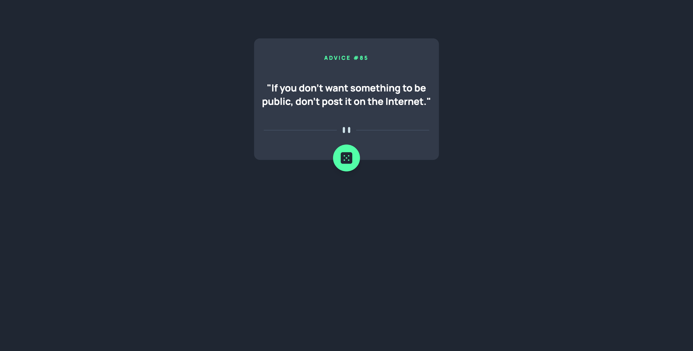
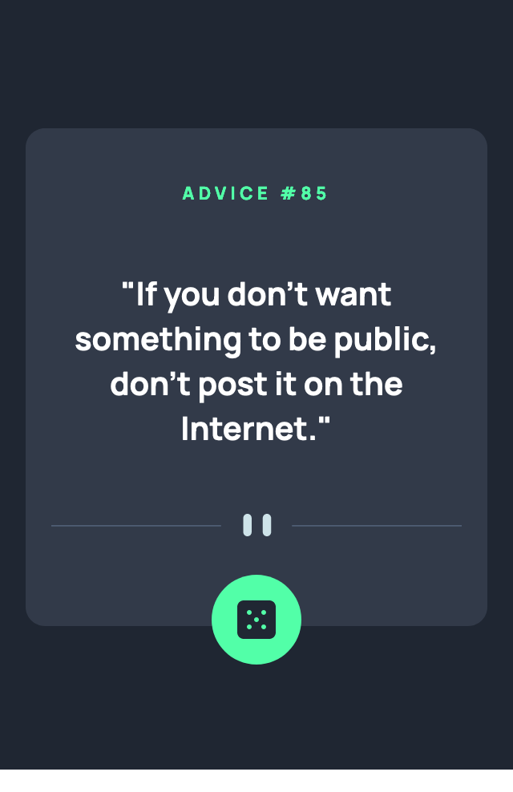

# Frontend Mentor - Advice generator app solution

This is a solution to the [Advice generator app challenge on Frontend Mentor](https://www.frontendmentor.io/challenges/advice-generator-app-QdUG-13db). Frontend Mentor challenges help you improve your coding skills by building realistic projects.

## Table of contents

- [Frontend Mentor - Advice generator app solution](#frontend-mentor---advice-generator-app-solution)
  - [Table of contents](#table-of-contents)
  - [Overview](#overview)
    - [The challenge](#the-challenge)
    - [Screenshots](#screenshots)
      - [Desktop](#desktop)
      - [Mobile](#mobile)
    - [Links](#links)
  - [My process](#my-process)
    - [Built with](#built-with)
  - [Author](#author)

## Overview

### The challenge

Users should be able to:

- Click on the dice button to generate a random advice quote

### Screenshots

#### Desktop

#### Mobile

### Links

- Solution URL: [https://www.frontendmentor.io/solutions/advice-generator-app-Ez9mTIF0G]
- Live Site URL: [https://my-advice-generator.netlify.app/]

## My process

### Built with

- [React](https://reactjs.org/) - JS library
- [TailwindCSS](https://tailwindcss.com/) CSS Framework
- Flexbox
- Mobile-first workflow

## Author
- Ameley Kwei-Armah
- Frontend Mentor - [@Amelss](https://www.frontendmentor.io/profile/Amelss)
  

